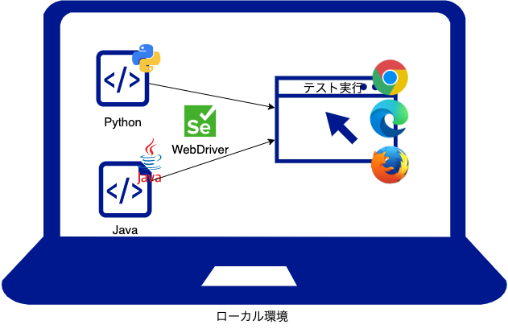
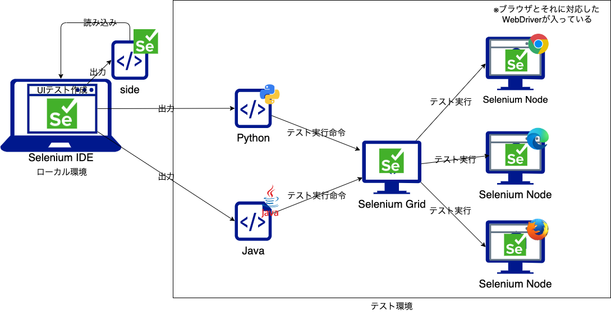
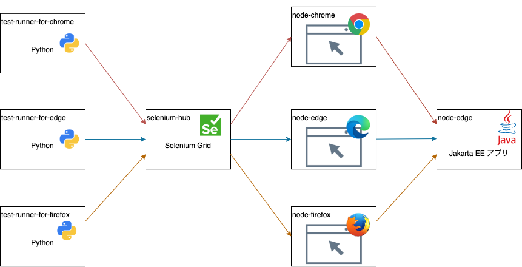

# Seleniumを利用したJakarta Server Facesアプリのクロスブラウザテストサンプル

## Seleniumを利用したテストの流れ

### ローカルで実行

- 実行イメージ

  

- ローカル利用時の課題
  - WebDriverと利用するブラウザのバージョンを合わせる必要がある

### コンテナで実行

- 実行イメージ
  

- コンテナ利用時の利点
  - ブラウザとそれに対応したWebドライバーが同梱されている
  - さまざまなバージョンでのテストが容易に実現可能

## サンプルアプリ

JakartaEEで作成されたWebアプリに対し、UIテストを自動化する

- テストで利用するコンテナの依存関係
　 

### URL

- テストアプリ
  - http://localhost:8080/selenium-demo
- Selenium　Grid
  - http://localhost:4444/

## 利用方法

- 事前準備

  ```sh
  $ docker-compose -f selenium/docker-compose.yaml build
  ```

- テスト環境の実行

  ```sh
  $ docker-compose -f selenium/docker-compose.yaml up
  ```

- 個別テストの再実行

  ```sh
  $ docker-compose -f selenium/docker-compose.yaml run test-runner-for-chrome test_demo_grid.py
  $ docker-compose -f selenium/docker-compose.yaml run test-runner-for-edge test_demo_grid.py
  $ docker-compose -f selenium/docker-compose.yaml run test-runner-for-firefox test_demo_grid.py
  ```

- 個別テスト実行(失敗ケース)

  ```sh
  $ docker-compose -f selenium/docker-compose.yaml run test-runner-for-chrome test_demo_grid_fail.py
  $ docker-compose -f selenium/docker-compose.yaml run test-runner-for-edge test_demo_grid_fail.py
  $ docker-compose -f selenium/docker-compose.yaml run test-runner-for-firefox test_demo_grid_fail.py
  ```

- テストケースを変更した時

  ```sh
  $ docker-compose -f selenium/docker-compose.yaml build --no-cache test-runner-for-chrome
  $ docker-compose -f selenium/docker-compose.yaml build --no-cache test-runner-for-edge
  $ docker-compose -f selenium/docker-compose.yaml build --no-cache test-runner-for-firefox
  $ docker-compose -f selenium/docker-compose.yaml run test-runner-for-chrome
  $ docker-compose -f selenium/docker-compose.yaml run test-runner-for-edge
  $ docker-compose -f selenium/docker-compose.yaml run test-runner-for-firefox
  ```

- テストアプリを変更した時

  ```sh
  $ docker-compose -f selenium/docker-compose.yaml build --no-cache app
  $ docker-compose -f selenium/docker-compose.yaml run app
  ```

## テストコードを作成した流れ

1. Selenium IDEを使って[sideプロジェクト](./selenium/seleniumu-demo.side)を作成
1. [sideプロジェクト](./selenium/seleniumu-demo.side)から、ローカル実行用[pythonテストコード初版](./selenium/test-runner/test_demo_local.py)を生成
1. [pythonテストコード初版](./selenium/test-runner/test_demo_local.py)をローカルで動くようにブラッシュアップ
    - [pythonテストコードv1](./selenium/test-runner/test_demo_local1.py)
      - chromedriver-binaryを追加（とりあえず動くようになった）
    - [pythonテストコードv2](./selenium/test-runner/test_demo_local2.py)
      - 処理が走る箇所で待ち時間を追加（なぜうまくいかないのか画面を見て判断できるように）
    - [pythonテストコードv3](./selenium/test-runner/test_demo_local3.py)
      - フォーム初期化処理を追加（v2の結果から必要な対応を実施）
    - [pythonテストコードv4](./selenium/test-runner/test_demo_local4.py)
      - スクリーンショットなどを保存
1. ローカル最終版を元に[コンテナ/CI実行用コード](./selenium/test-runner/test_demo_grid.py)に編集

## 所感

- テストコードの作成
  - sideプロジェクトからテストコードが自動生成できるがそのままでは利用できない
    - ajax処理待ちや入力値のクリアなど
  - テストコードは`Python`か`Java`での出力が良さそう
    - Pythonはスクリプト言語なので実行が楽
      - Java9以降になれば、jshellでも実行できる？
    - Javaは社内に知見が多い
  - sideプロジェクトは残しておいた方が良さそう
    - 出力したテストコードからsideプロジェクトへの変換は不可のため
  - 新規作成時は、以下の作成手順が良さそう
    1. Selenium IDEでテストプロジェクト(side)を作成
    1. テストプロジェクトから、テストコード(`Python`)を生成
    1. ローカルでpython形式で正常終了するようテストコードを修正する
        - Ajaxやページ遷移時の処理待ちの追加
          - これを入れないと、失敗時にどんな処理が行われるているか早すぎて追えない
        - 必要に応じて入力値クリアなど
    1. スクショなどを盛り込む
    1. コンテナ/CI実行用にカスタマイズ
- JSFとの親和性
  - 生成したテストコードが長期間安定的に利用可能とするため、テスト対象となるhtml要素に対し明示的にIDを振り、変更すべきではない
    - IDがない要素は、cssセレクタ指定となる模様
      - liの２つ目の要素(`li:nth-child(2)`)など
    - JSFの仕様によりテーブル(dataTable)のレコード、カラムには意図したIDが振れない
      - 作成したxhtml

        ```xhtml
        <h:dataTable id="item-table" border="1" var="item" value="#{page1Bean.itemList}">
          <h:column>
            <f:facet name="header">名前</f:facet>
            <!-- `tabel-item-xxx` を付与したかった -->
            <h:outputText id="tabel-item-#{item.name}" value="#{item.name}" />
          </h:column>
        ```

      - 描画されたhtml

        ```html
        <table id="item-table" border="1">
            :
          <tbody>
            <tr>
              <td>
                <!-- `#{item.name}`が反映されない -->
                <!-- `item-table:0:`が自動で付与されている -->
                <span id="item-table:0:tabel-item-">
                  りんご
                </span>
        ```

    - formタグ中のinput要素のIDもデフォルトではformのIDがくっついてしまうので、prependId=falseを付与する
      - xhtml

        ```xhtml
        <h:form prependId="false">
              :
          <h:inputText id="new-item-name" value="#{page1Bean.newItemName}" />
        ```

      - html出力

        ```xhtml
        <form id="j_idt5" name="j_idt5" method="post" action="/selenium-demo/page1.xhtml" enctype="application/x-www-form-urlencoded">
            :
          <input id="new-item-name" type="text" name="new-item-name">
        ```

      - `prependId="true"(デフォルト)`の場合のhtml出力

        ```xhtml
        <form id="j_idt5" name="j_idt5" method="post" action="/selenium-demo/page1.xhtml" enctype="application/x-www-form-urlencoded">
            :
          <input id="j_idt5:new-item-name" type="text" name="new-item-name">
        ```

## 今後の展望

- 実際のプロジェクトでのテストコードの長期利用性の検証
  - ブラウザ、APサーバのバージョンアップ

- アプリ改修時のテストコードの改修方法の調査
  - sideプロジェクトを変更？ or 直接テストコードを変更？

- テストコードの言語の比較(java,Python)
  - テスト失敗時の処理(エビデンス取得など)の拡張しやすさ
