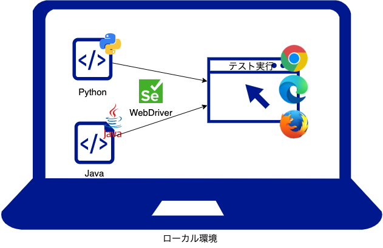
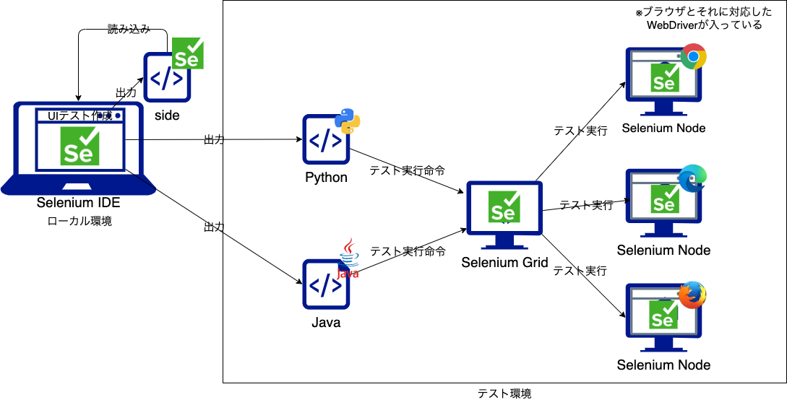

# SeleniumによるJSFアプリのクロスブラウザUIテスト自動化の可能性と課題

---

## アジェンダ

1. 結論
1. Seleniumによるテスト自動化の流れ
    1. Seleniumを利用したテスト実行
    1. Selenium IDEをテストコード
    1. Selenium IDE + Selenium Gridを利用したテスト実行
1. CI組み込みまでで詰まったところ
    1. Selenium IDEでテストコード出力
    1. ローカルでのテストコード実行
    1. docker(Selenium Grid + Selenium Node)でテストコード実行
1. 所感
1. 今後の展望

---

## 結論

- Selenium IDEで**自動生成したテストコードは、そのままでは使えない**
  - 「side projectをそのままローカルで実行する」と「自動化コードに変換する」のメリデメを比較する必要がある
  - 自動化コードの作成は、「ローカルで実行可能な状態」→「Gridで実行可能な状態」→「CI適用」という順で作成するとよい
- JSFなどAPサーバを介してhtml(id)が描画されるフレームワークは、**テストコードを長期安定的に利用できない可能性がある**
  - idベースでdom操作を行うテストコードであれば効果は高い

---

## Seleniumによるテスト自動化の流れ

---

### Seleniumによるテスト自動化の方法



---

### Selenium IDEによるテストコードの自動生成


---

### Selenium Gridによるテストコード実行



---

## CI組み込みまでで詰まったところ

---

### ローカルでのテストコード実行①

1. Selenium IDEを使って[sideプロジェクト](./selenium/seleniumu-demo.side)を作成
2. [sideプロジェクト](./selenium/seleniumu-demo.side)から、ローカル実行用[pythonテストコード初版](./selenium/test-runner/test_demo_local.py)を生成
    とりあえず、実行してみたが動かない！

    ```console
    $ pytest ./selenium/test-runner/test_demo_local.py

    E selenium.common.exceptions.WebDriverException: 
    Message: 'chromedriver' executable needs to be in PATH. 
    Please see https://chromedriver.chromium.org/home
    ```

    Web Driberの追加が必要とのことなので、ブラウザに対応したWebDriverを導入し、プログラムにimportした。

    ```console
    $ pip install chromedriver-binary==110.0.5481.77
    ```

    ```py
    import chromedriver_binary
    ```

---

### ローカルでのテストコード実行②

3. ①で作成した[pythonテストコードv1](./selenium/test-runner/test_demo_local1.py)を実行

    しかし、エラー発生。

    ```console
    $ pytest ./selenium/test-runner/test_demo_local1.py
    E selenium.common.exceptions.NoSuchElementException: Message: no such element: 
    Unable to locate element: {"method":"css selector","selector":"li:nth-child(1)"}
    ```

    一瞬、画面が表示されるも何が何だかわからない...
    エラー文から画面変更が発生するイベント処理後の評価(assert)で、画面変更を待たずに評価してしまっていると思われる

    そこで、各ボタン操作後、評価前に待ち時間を追加

    ```py
    self.driver.find_element(By.ID, "add-new-item").click()
    time.sleep(1) #←待ち時間を追加
    assert self.driver.find_element(By.CSS_SELECTOR, "li:nth-child(1)").text == "品名を入力してください"
    assert self.driver.find_element(By.CSS_SELECTOR, "li:nth-child(2)").text == "個数を入力してください"
    ```

---

### ローカルでのテストコード実行③

4. ②で作成した[pythonテストコードv2](./selenium/test-runner/test_demo_local2.py)を実行

    当初のエラーは解消したものの、やはり、うまくいかない...

    ```console
    E selenium.common.exceptions.NoSuchElementException: Message: no such element: 
    Unable to locate element: {"method":"css selector","selector":"[id="item-table:2:tabel-item-"]"}
    ```

    実行画面を見ていると、思った入力がなされていないことが判明。

    ```py
    self.driver.find_element(By.ID, "new-item-amount").send_keys("-1")
                :
    self.driver.find_element(By.ID, "new-item-amount").send_keys("1")
    # id=new-item-amountの入力値が"1"となることを期待するが, 前の-1が残ったままとなり"-11"となってしまう。
    ```

    そこで、フォームを再入力する際は、初期化するように変更

    ```py
    self.driver.find_element(By.ID, "new-item-amount").send_keys("-1")
                :
    self.driver.find_element(By.ID, "new-item-amount").clear()# フォーム再入力前に値を明示的にクリア
    self.driver.find_element(By.ID, "new-item-amount").send_keys("1")
    ```

---

### ローカルでのテストコード実行④

5. ③で作成した[pythonテストコードv3](./selenium/test-runner/test_demo_local2.py)を実行し、テストが通ることを確認

6. ③で作成した[pythonテストコードv3](./selenium/test-runner/test_demo_local2.py)に、評価時にスクリーンショットを撮る処理を追加

    ```py
    time.sleep(1)
    # 追加：スクリーンショットの取得
    # assert後にスクリーンショットを処理を入れると、期待する処理をしない際にスクリーンショットが取得できない
    self.driver.save_screenshot("./results/local/test1.png")
    assert self.driver.find_element(By.CSS_SELECTOR, "li:nth-child(1)").text == "品名を入力してください"
    assert self.driver.find_element(By.CSS_SELECTOR, "li:nth-child(2)").text == "個数を入力してください"
    ```

    - スクリーンショット抜粋  

      ||
      |:---:|

---

### docker(Selenium Grid + Selenium Node)でテストコード実行①

1. テスト環境の作成
    1. [Test Runenrコンテナ定義ファイル](./selenium/test-runner/Dockerfile)の作成  
      起動時に`pytest`を実行する[Dockerfile](./selenium/test-runner/Dockerfile)を作成
    1. [docker-compose.yaml](./selenium/docker-compose.yaml)の作成
        - 利用するコンテナ
          - app(テスト対象アプリ)
          - selenium-hub
          - node  
            ブラウザの実行環境。テスト対象ブラウザ分用意する
          - test-runner  
            テストを実行するコンテナ。テスト対象ブラウザ分用意する
          - finalizer  
            test完了判定用コンテナ。CIでテスト結果判定に利用する

---

### docker(Selenium Grid + Selenium Node)でテストコード実行②

- docker-composeにおけるサービス依存関係(起動順)に関する注意点  
  テストに必要な環境が正常起動したのちにテストを実施する必要があるため、サービスの起動の順序やその条件を指定する必要がある。
  - test-runner  
    selenium-hub, node, appの`healthcheck`定義を記載する  
    test-runnerは、selenium-hub, node, appの`service_healthy(起動完了)`を確認してから起動させる
  - finalizer  
    test-runnerの`service_completed_successfully(正常終了)`を確認してから実行する。  
    テスト実行コマンドである`docker-compose up　-d`は、全てのコンテナ起動開始後にプロンプトが返る。そのため、プロンプトが戻った後すぐにテスト結果を確認できるよう、テスト完了に依存したコンテナを用意した。

---

### docker(Selenium Grid + Selenium Node)でテストコード実行③

2. [Selenium Grid向けテストコード](./selenium/test-runner/test_demo_grid.py)の作成  
  テスト対象ブラウザ,Seleum GridのURLを外部化し、適切なDriverを生成させる

    ```py
    # 環境変数からブラウザにあったオプションを設定
    browser = os.environ['BROWSER']
    if browser == "firefox":
      options = webdriver.FirefoxOptions()
    elif browser == "edge":
      options = webdriver.EdgeOptions()
      options.user_chromium = True
    else: #Chrome
      options = webdriver.ChromeOptions()
    # selenium gridのURLを設定
    hostname = os.environ['HUB_HOST']
    command_executor = "http://" + hostname + ":4444/wd/hub"
    # Driverの作成
    self.driver = webdriver.Remote(
      command_executor=command_executor,
      options=options,
    )
    ```

---

### CI(GitHub Actions）への組み込み①

1. [CI(GitHub Actions実行コード)](./.github/workflows/selenium-test.yaml)に記載

    以下コマンドにより、テスト実行および評価を実施する

    ```sh
    docker compose -f selenium/docker-compose.yaml up -d
    # Chromeテスト結果確認
    # github-hosted-runnerのdocker-composeでは、--formatオプションが利用不可のため
    # docker composeを利用する。この場合、停止したコンテナの表示に-aオプションが必要となる
    docker compose -f selenium/docker-compose.yaml logs test-runner-for-chrome
    EXITCODE=$(docker compose -f selenium/docker-compose.yaml \
                ps -a --format json test-runner-for-chrome | jq '.[0].ExitCode');
    if [ $EXITCODE -ne 0 ]; then exit 1; fi
    # Edgeテスト結果確認
    docker compose -f selenium/docker-compose.yaml logs test-runner-for-edge
    EXITCODE=$(docker compose -f selenium/docker-compose.yaml \
                ps -a --format json test-runner-for-edge | jq '.[0].ExitCode');
    if [ $EXITCODE -ne 0 ]; then exit 1; fi
    # Firefoxテスト結果確認
    docker compose -f selenium/docker-compose.yaml logs test-runner-for-firefox
    EXITCODE=$(docker compose -f selenium/docker-compose.yaml \
                ps -a --format json test-runner-for-firefox | jq '.[0].ExitCode');
    if [ $EXITCODE -ne 0 ]; then exit 1; fi
    ```

---

## 所感

---

### 所感（テストコードの作成）

- sideプロジェクトのまま利用するか、テストコードへ変換するかは要判断
  - ajax処理待ちや入力値のクリアなど別途追加処理が必要

- sideプロジェクトは残しておいた方が良さそう
  - 出力したテストコードからsideプロジェクトへの変換は不可のため

- CI組み込み時は、以下の作成手順が良さそう
  1. Selenium IDEでテストプロジェクト(side)を作成
  1. テストプロジェクトから、テストコードを生成
  1. テストコードをローカルで正常実行するよう修正する
  1. スクショなどを盛り込む
  1. コンテナ/CI実行用にカスタマイズ

---

### 所感（JSFとの親和性①）

- HTML要素への明示的なID付与が難しい  
  生成したテストコードが長期間安定的に利用可能とするため、 **テスト対象となるhtml要素に対し明示的にIDを振り、変更すべきではない**  
  IDがない要素は、cssセレクタ指定として指定する（liの２つ目の要素`li:nth-child(2)`など）

  しかし、**JSFでは**、APサーバの機能を利用してhtmlを生成しているため、**自動的にIDが設定されてしまったり、意図したID指定が難しい場合がある**。  （`<h:form>`(回避策あり)、`<h:dataTable>`など）

  上記理由から、SeleniumによるUIテスト自動化は、ピュアなhtmlを利用する(明示的なID指定可能な)フレームワークの方が向いていると考えられる。

---

### 所感（JSFとの親和性②　`<h:form>`）

formの子要素は、デフォルトでformのIDがくっついてしまうため、`prependId=false`を付与する

- xhtml

  ```xhtml
  <h:form prependId="false">
    <h:inputText id="new-item-name" value="#{page1Bean.newItemName}" />
  ```

- html出力

  ```xhtml
  <form id="j_idt5" name="j_idt5" method="post" action="/selenium-demo/page1.xhtml" ...>
    <input id="new-item-name" type="text" name="new-item-name">
  ```

- `prependId="true"(デフォルト)`の場合のhtml出力

  ```xhtml
  <form id="j_idt5" name="j_idt5" method="post" action="/selenium-demo/page1.xhtml" ...>
    <input id="j_idt5:new-item-name" type="text" name="new-item-name">
  ```

---

### 所感（JSFとの親和性③　`<h:dataTable>`）

JSFの仕様によりテーブル(dataTable)のレコード、カラムには意図したIDが振れない

- xhtml

  ```xhtml
  <h:dataTable id="item-table" border="1" var="item" value="#{page1Bean.itemList}">
    <h:column>
      <f:facet name="header">名前</f:facet>
      <!-- id=`tabel-item-品名` としたかった -->
      <h:outputText id="tabel-item-#{item.name}" value="#{item.name}" />
  ```

- html

  ```html
  <table id="item-table" border="1">
    <td>
      <!-- `#{item.name}`が反映されない -->
      <!-- `item-table:0:`が自動で付与されている -->
      <span id="item-table:0:tabel-item-">
        りんご
      </span>
  ```

---

## 今後の展望

- 実際のプロジェクトでのテストコードの長期利用性の検証
  - ブラウザ、APサーバのバージョンアップ

- アプリ改修時のテストコードの改修方法の調査
  - sideプロジェクトを変更？ or 直接テストコードを変更？

- テストコードの言語の比較(java,Python)
  - テスト失敗時の処理(エビデンス取得など)の拡張しやすさ
